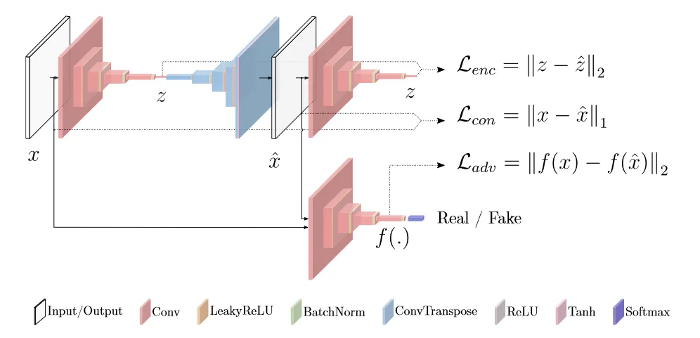
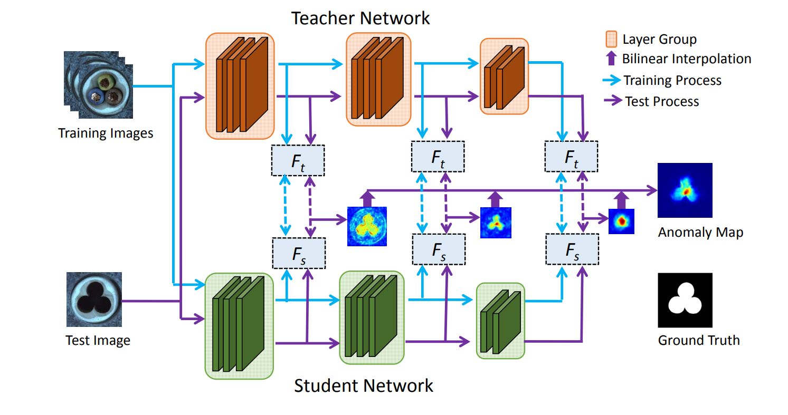
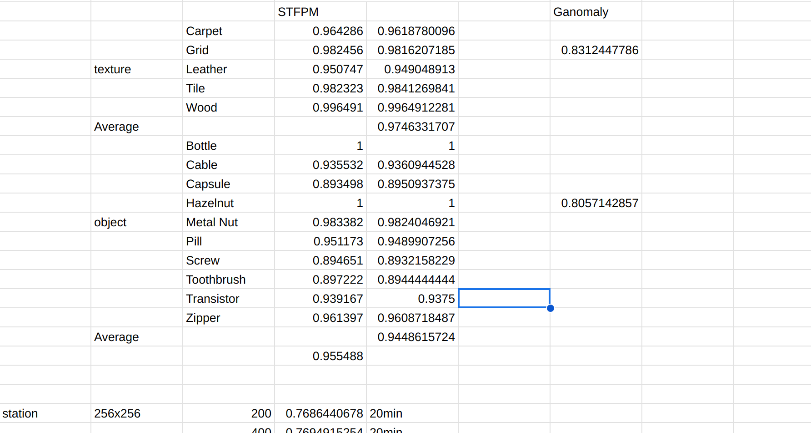

# Abstract

Trong thực tế hiện tại ở Viettel, bài toán phát hiện ảnh bất thường có thể được áp dụng để giải quyết rất nhiều vấn đề, một trong số đó là kiểm tra các ảnh chụp nhà trạm. Các phương pháp phát hiện bất thường truyền thống cần nhiều nhân lực và tài nguyên nhưng vẫn không thể đáp ứng các yêu cầu về độ chính xác theo thời gian thực. Đồng thời những thuật toán học máy phân loại truyền thống (SVM, Decision Trees,..) khó có thể phát hiện bất thường ở các mẫu chưa từng được huấn luyện. Trong nghiên cứu này, chúng tôi sẽ tập chúng triển khai và đánh giá việc ứng dụng các mô hình học sâu - mô hình Đối sinh (GANs) là GANomaly và Skip-GANomaly thuộc nhóm phương pháp (recontruction) để phát hiện ảnh bất thường trên tập dữ liệu nhà trạm thực tế ở Viettel. Báo cáo này cũng so sánh kết quả của các mô hình sinh ảnh (GANs) với một mô hình học sâu phát hiện bất thường khác thuộc nhóm phương pháp (feature-embedding) là STFPM. Kết quả của nghiên cứu này cho thấy năng lực phát hiện bất thường của GANomaly, đồng thời cũng làm nổi bật các điểm mạnh và hạn chế của nó.

# 1. Introduction

Theo định kỳ, nhân viên nhà trạm sẽ đi chụp ảnh nhà trạm nhằm phục vụ mục đích bảo dưỡng nhà trạm. Và cùng với sự phát triển của các mô hình học sâu đặc biệt là trong xử lý hình ảnh, chúng tôi đã khảo sát việc ứng dụng các mô hình học sâu để có thể kiểm tra ảnh nhân viên chụp và phát hiện các đối tượng bất thường. Sự bất thường của ảnh có thể được ví dụ như các trường hợp sau: chụp sai hướng dẫn, vật thể trong ảnh bị hỏng hóc, thiếu sót. Tập dữ liệu để huấn luyện của bài toán này có đặc điểm sẽ chỉ thiên về một lớp là các ảnh được gán nhãn bình thường do việc thu thập mẫu và gán nhãn cho lớp bất bình thường sẽ tốn chi phí lớn về con người và tài chính mà lại không thể bao quát được tất cả các trường hợp bất thường có thể xảy ra. Vậy nên, trong nghiên cứu này chúng tôi sẽ tập trung xem xét đến các thuật toán học không giám sát để giải quyết bài toán trên.

Dựa trên các thuật toán đã được phát triển và thử nghiệm trên tập dữ liệu MVTec AD, các mô hình học không giám sát trong lĩnh vực này hiện tại có thể được chia thành hai nhóm phương pháp chính là: nhúng các đặc trưng (feature-embedding) và tái tạo (reconstruction). Trong nghiên cứu này, chúng tôi sẽ chọn hai mô hình mạng Đối sinh (GANs) thuộc phương pháp tái tạo (reconstruction) là GANomaly, Skip-GANomaly và một mô hình thuộc phương pháp feature-embedding là STFPM để thử nghiệm và đánh giá hiệu suất trên tập dữ liệu MVTec AD và tập dữ liệu nhà trạm thực tế của Viettel.

# 2. Related work

## 2.1 Reconstruction based Methods

Các phương pháp này dựa trên việc tự đạo tạo bộ mã hóa (encoder) và bộ giải mã (decoder) để tái tạo hình ảnh nhằm phát hiện những điểm bất thường. Tuy nhiên, khả năng phân loại ảnh của nó kém, do không thể trích xuất được các đặc trưng có tính ngữ nghĩa cao (highlevel semantic features).

 
Fig 1. Cấu trúc của các mô hình phát hiện bất thường bằng phương pháp tái tạo.

Cấu trúc của các mô hình thuộc phương pháp tái tạo được mô tả trong hình [1]. Trong quá trình đào tạo, các hình ảnh bất thường sẽ được gửi đến mạng tái tạo (reconstruction network) và hàm mất mát của quá trình này sẽ được sử dụng để cải thiện khả năng tái tạo của mạng. Trong quá trình kiểm thử, để có thể đưa ra dự đoán, mô hình sẽ so sánh ảnh gốc với ảnh được tái tạo. Các mô hình trong phương pháp này chủ yếu sẽ khác nhau ở việc xây các mạng tái tạo (reconstruction network). Phần lớn các phương pháp này dựa trên việc tự đào tạo từ đầu mà không sử dụng các mô hình pre-trained, dẫn đến hiệu suất kém hơn so với mô hình ở nhóm phương pháp feature-embedding.

## 2.1.1 GANomaly
Các nghiên cứu ban đầu đã sử dụng bộ mã hóa tự động (AE) để làm mạng tái tạo cho phát hiện bất thường. Năm 2014, Goodfellow đề xuất mạng Đối sinh (GAN)[16] bằng cách đồng huấn luyện một cặp mạng (bộ tạo - generator và bộ phân biệt - discriminator). Sau đó, GAN được sử dụng nhiều hơn để áp dụng vào bài toán phát hiện bất thường. 

 
Fig 2. Cấu trúc của mô hình GANomaly

GANomaly là một mô hình phát hiện bất thường sử dụng kiến trúc của mạng Đối sinh (GANs) để học phân phối của dữ liệu. GANomaly thực hiện một cải tiến là đưa ra dự đoán dựa trên việc so sánh không gian đặc trưng tiềm ẩn (latent space) thu được từ lần mã hóa đầu tiên và không gian đặc trưng tiềm ẩn (latent space) thu được ở lần mã hóa thứ hai. Do trong quá trình đào tạo, đầu vào của mạng chỉ là những mẫu thuộc lớp bình thường, nên mạng sinh sẽ chỉ học được phân phối của dữ liệu các mẫu bình thường. Ở quá trình suy luận đưa ra dự đoán, nếu đầu vào là các mẫu bất thường thì theo giả định khoảng cách giữa hai không gian đặc trưng tiềm ẩn sẽ lớn hơn do không được học trong quá trình đào tạo. Khi khoảng cách giữa hai không gian đặc trưng tiềm ẩn của một ảnh đầu vào vượt qua một ngưỡng nhất định, thì nó được xác định là một mẫu bất thường.

Có thể chia cấu trúc của GANomaly thành 3 thành phần chính:
- Bộ mã hóa tự động (autoencoder), đồng thời cũng là phần sinh (generator) để học cách tái tạo lại đầu vào.
- Phần phân biệt (discriminator), được xử dụng để phân biệt ảnh đầu vào và ảnh sau khi được tái tạo bởi phần sinh (generator). Qua đó có thể cải thiện chất lượng của kết quả của phần sinh (generator).
- Bộ mã hóa (encoder) thứ hai, ánh xạ ảnh sau khi tạo bởi phần sinh thành một không gian các đặc trưng tiềm ẩn (latent space) - $z'$.

Trong quá trình đào tạo, hàm mục tiêu của mô hình là kết hợp của ba hàm mất mát sau:
- Adversarial Loss: là khoảng cách L2 giữa biểu diễn đặc trưng của ảnh gốc $x$ và biểu diễn đặc trưng của ảnh được tạo bởi phần sinh generator $G(x)$. Trong hàm mất mát này, $f(x)$ là đầu ra của bộ phân loại của phần phân biệt (discriminator): $$\mathcal{L}_{adv} = \mathbb{E}_{x \sim p_x}\left \| f(x) - \mathbb{E}_{x \sim p_x}f(G(x)) \right \|_2.$$
- Contextual Loss: là khoảng cách L1 giữa đầu vào ban đầu $x$ và hình ảnh được tạo $G(x)$. Hàm mất mát này giúp hàm mục tiêu có thêm thông tin về ngữ cảnh của đầu vào:$$\mathcal{L}_{con} = \mathbb{E}_{x \sim p_x}\left \| x - G(x) \right \|_1.$$

- Encoder Loss: là khoảng cách L2 giữa các không gian đặc trưng tiềm ẩn của đầu vào $z$ và của hình ảnh được tạo bằng bộ sinh $z'$. Với hàm mất mát này, phần sinh (generator) sẽ được hướng dẫn để hiểu cách mã hóa các đặc trưng của các mãu bình thường: $$\mathcal{L}_{enc} = \mathbb{E}_{x \sim p_x}\left \| G_{E}(x) - E(G(x)) \right \|_2.$$

Và hàm mục tiêu được xác định với việc thêm trọng số vào các hàm mất mát trên:$$\mathcal{L} = w_{adv}\mathcal{L}_{adv} + w_{con}\mathcal{L}_{con} + w_{enc}\mathcal{L}_{enc} $$

Trong quá trình kiểm thử, độ bất thường của ảnh thử nghiệm được định nghĩa theo hàm Encoder Loss: $$ \mathcal{A}(\hat{x}) = \left \| G_{E}(\hat{x}) - E(G(\hat{x})) \right \|_1$$

## 2.2 Feature Embedding based Methods
### 2.2.1 STFPM - Student-Teacher Feature Pyramid Matching for Anomaly Detection
Kết quả về hiệu suất của phương pháp này khá nổi bật, nhưng nó phụ thuộc vào việc lựa chọn được các mô hình pre-trained như ResNet, VGG hoặc EfficientNet để làm "giáo viên" hướng dẫn cho mô hình.

 
Fig 3. Cấu trúc của mô hình STFPM

Kiến trúc của phương pháp này gồm hai mạng là giáo viên và học sinh. Mạng giáo viên sẽ là một mạng mạnh mẽ đã được đào tạo trước trên các tập dữ liệu, về phân loại hình ảnh (ví dụ: ResNet-18 được đào tạo trên ImageNet) và mạng học sinh sẽ có cùng kiến trúc với mạng giáo viên nhưng chưa qua quá trình đào tạo.
Trong quá trình đào tạo, mạng "giáo viên" sẽ "truyền đạt", hướng dẫn cho mạng học sinh các kiến thức về trích chọn đặc trưng của ảnh trên tập đầu vào là các hình ảnh được gán nhãn bình thường. Và trong quá trình suy luận, các đặc điểm về mẫu bất thường được trích xuất từ mạng học sinh và giáo viên sẽ tương đương nhau, trong khi các đặc điểm được trích xuất từ ảnh bất thường sẽ khác biệt. Bằng cách so sánh bản đồ đặc trưng (feature maps) được tạo bởi hai mạng, ta có thể tạo ra được bản đồ các điểm bất thường.

# 3. Expriments setup
??? Trong phần này, chúng tôi sẽ giới thiệu về các tập dữ liệu đã được dùng để đánh giá và kết quả của việc huấn luyện các mô hình trên các tập dữ liệu đó.
## 3.1 Dataset
**MVTec**, chúng tôi đã tiến hành thử nghiệm các mô hình trên tập dữ liệu MVTec Anomaly Detection (MVTec AD). ....
**Bộ dữ liệu nhà trạm của Viettel**, 

# 4.Kết quả
## 4.2 Kết quả GANomaly và STFPM trên tập dữ liệu MVTec AD
??? Trong thí nghiệm này, chúng tôi đã huấn luyện và đánh giá hai mô hình GANomaly và STFPM trên tập dữ liệu MVTec. Kết quả là STFPM hoàn toàn vượt trội trên tập MVTEC 
 

## 4.3 Kết quả GANomaly và STFPM trên tập dữ liệu nhà trạm của Viettel

#  Discussion
??? Kết quả của các thí nghiệm trên chưa phản ánh được đầy đủ khả năng của các mạng Đối sinh (GANs) trong bài toán phát hiện bất thường, do giới hạn của.... Bên cạnh đó, quá trình để huấn luyện GANs cũng là một thách thức lớn. Để có thể đảm bảo được hai phần mạng sinh (generator) và mạng phân loại (discriminator) có thể ổn định học song song với nhau thì cần phải lựa chọn các siêu tham số một cách cẩn thận sao cho tốc độ học của hai mạng này đồng đều nhau. Vì vậy các nghiên cứu ở trong tương lai, chúng tôi sẽ phát triển dựa trên nhóm phương pháp tái tạo (reconstruction) nhưng sử dụng các mô hình sinh ảnh tốt hơn ví dụ như diffusion....

# 5. Kết luận
???? 

# References
