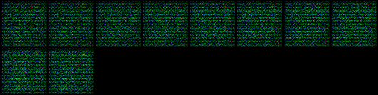

# Report 23-05

## Kết quả

> Kết quả train GANomaly với config:
>- number of epochs : 100
>- random seed :  42
>- size of image after crop : 64
>- size of latent vector  : 100
>- default: lr : 0.0002, b1 : 0.5, b2 : 0.999
>- w_adv = 1, w_con = 40, w_enc = 1
>- optimizer : Adam

|Class name      |F1 score       |Accuracy      | AUC          |
|----------------|--------------|---------------|--------------|
|metal_nut       |0.894         |0.8            |0.399         |
|grid            |0.868         |0.769          |0.751         |
|hazelnut        |0.778         |0.627          |0.666         |

## Experiments
> Đây là kết quả ảnh sinh được x_hat (x_hat = Generator(x)) 

### metal_nut

### hazelnut

### grid

## Training process
> Đây là kết quả ảnh sinh được qua các epoch 

### metal_nut

|Input                                              |              Output                                 |
|:-------------------------------------------------:|:---------------------------------------------------:|
|  |   |
|  |   |
|  |   |
|  |   |
|  |   |
|  |   |
|  |   |
|  |   |
|  |   |
|  |   |

### hazelnut

|Input                                              |              Output                                 |
|:-------------------------------------------------:|:---------------------------------------------------:|
|  |   |
|  |   |
|  |   |
|  |   |
|  |   |
|  |   |
|  |   |
|  |   |

