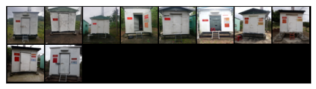

# Report 23-05

## A Summary of Completed Tasks

### Implementation and evaluation STFPM Model on MVTEC Dataset

>Config:
>- number of epochs : 500
>- random seed :  42
>- size of image after transform : 256x256
>- size of loss image : 64x64
>- Teacher/Student model : Resnet18 
>- Teacher pretrained weight : IMAGENET1k_v1
>- optimizer : SGD (lr=0.4, momentum=0.9, weight_decay=1e-4)

|Class name      |F1 score       |Accuracy      | AUC          |
|----------------|--------------|---------------|--------------|
|metal_nut       |1.0           |0.9913         |1.0           |
|grid            |0.9912        |0.9744         |0.9958        |
|hazelnut        |0.778         |0.627          |0.666         |

#### Examples

##### metal_nut

|Input                                              |              Output                                 |
|:-------------------------------------------------:|:---------------------------------------------------:|
|  |  |

Score Histogram: Normal (Orange) vs. Anomalous (Blue) Images 

##### grid

|Input                                              |              Output                                 |
|:-------------------------------------------------:|:---------------------------------------------------:|
|  |  |

Score Histogram: Normal (Orange) vs. Anomalous (Blue) Images 

<!-- ##### hazelnut
|Input                                              |              Output                                 |
|:-------------------------------------------------:|:---------------------------------------------------:|
|  |  |

Score Histogram: Normal (Orange) vs. Anomalous (Blue) Images 

 -->

### Implemetation and evaluation STFPM Model on Station Dataset

>Config:
>- number of epochs : 500
>- random seed :  42
>- size of image after transform : 256x256
>- size of loss image : 64x64
>- Teacher/Student model : Resnet18 
>- Teacher pretrained weight : IMAGENET1k_v1
>- optimizer : SGD (lr=0.4, momentum=0.9, weight_decay=1e-4)

|Dataset         |F1 score       |Accuracy       | AUC          |
|----------------|---------------|---------------|--------------|
|Station         |0.7447         |0.7475         |0.8390        |

#### Example
|Input                                              |              Output                                 |
|:-------------------------------------------------:|:---------------------------------------------------:|
|  |  |

Score Histogram: Normal (Orange) vs. Anomalous (Blue) Images 

### Implemetation and evaluation GANomaly Model on Station Dataset

>Config:
>- number of epochs : 1000
>- random seed :  42
>- size of image after transform : 128x128
>- size of latent vector : 100
>- optimizer : Adam (lr = 0.0001, b1 = 0.5, b2 = 0.999)
>- w_adv, w_con, w-enc : 1, 40, 1

|Dataset         |F1 score       |Accuracy       | AUC          |
|----------------|---------------|---------------|--------------|
|Station         |0.6055         |0.5555         |0.6597        |

#### Example
|Input                                              |              Output                                 |
|:-------------------------------------------------:|:---------------------------------------------------:|
|  |  |
|  |  |

Score Histogram: Normal (Orange) vs. Anomalous (Blue) Images 

## Upcoming Tasks for the Following Week

- Kích thước input hiện tại e vẫn fix là hình vuông để giống với tập MVTec, nên chưa đạt được kq tốt.
- Thiết kế lại kiên trúc của Encoder, Decoder của GANomaly cho phù hợp với kích thước của dataset Station
- Tìm kích thước tối ưu của input và latent vector cho dataset Station 

